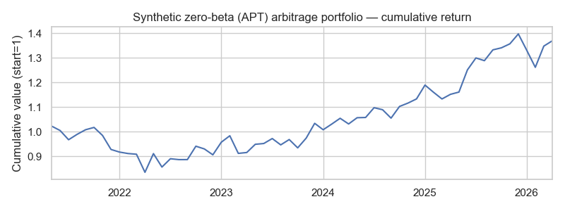
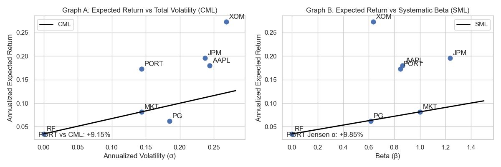

# Asset Pricing Architectures — CAPM, APT, and Risk‑Adjusted Performance (Technical Report)

**Course assignment:** Empirical CAPM, APT, and Risk‑Adjusted Performance Measures  
**Lecturer:** Beatrice Maina  
**Market chosen:** USA (NYSE example)  
**Frequency:** Monthly (resampled from daily data)  
**Window:** 5 years (60 monthly observations)  
**Date:** 2026‑05‑19  

> Replace the placeholders below with your group details.

**Group members (max 5):**
- JUNELENCER LOVE — Reg No.
- Name 2 — Reg No.
- Name 3 — Reg No.
- Name 4 — Reg No.
- Name 5 — Reg No.

## Executive summary
This project connects real historical market data to three asset‑pricing architectures:

1) **CAPM (single‑factor market model)** to estimate systematic risk (beta) and abnormal performance (alpha) for 4 equities and a fixed‑weight portfolio.
2) **APT (two‑factor macro model)** using inflation and policy‑rate shocks to estimate factor sensitivities and build a **factor‑neutral (zero‑beta) synthetic arbitrage** portfolio.
3) **Risk‑adjusted performance measures** (Sharpe, Treynor, Jensen’s alpha) and **CML/SML** charts for diagnostic comparison.

All computations are implemented in the production notebook at `notebooks/asset_pricing_models.ipynb` and the repository contains the cached data and outputs needed to reproduce the results.

---

## Data specification & sources (Required data)
### Assets (4 equities, different sectors)
- **AAPL** (Technology)
- **JPM** (Financials)
- **XOM** (Energy)
- **PG** (Consumer Staples)

### Market portfolio proxy (Rm)
- **NYSE Composite Index**: `^NYA` (Yahoo Finance)

### Risk‑free rate (Rf)
- **91‑day / 3‑month Treasury Bill yield**: FRED series `TB3MS` (monthly, percent annualized)

### APT macroeconomic factors (2)
- **CPI level**: FRED series `CPIAUCSL`
- **Fed Funds rate**: FRED series `FEDFUNDS`

### Data sources
- Equities + market index: Yahoo Finance (`yfinance`) adjusted close (daily)
- Macro + risk‑free: FRED CSV endpoint (no API key required)

### Model window (exact dataset used)
The cleaned modeling dataset has:
- **Start:** 2021‑05‑31
- **End:** 2026‑04‑30
- **Observations:** 60 monthly points

The dataset used in modeling is stored at `data/processed/monthly_model_dataset.csv`.

---

## Data processing & parameter extraction (Q1.1)
### Monthly sampling
To reduce microstructure noise, daily adjusted prices are resampled to **month‑end** and we take the **last available** observation in each month.

### Log monthly returns
For any price series \(P_t\), monthly **log return** is computed as:

- `r_t = ln(P_t / P_{t-1})`

### Risk‑free conversion (annual yield → monthly return)
`TB3MS` is a **monthly series in annualized percent**. We convert it to a monthly simple return and then to monthly log return:

- `rf_annual = TB3MS / 100`
- `rf_monthly_simple = (1 + rf_annual)^(1/12) - 1`
- `rf_monthly_log = ln(1 + rf_monthly_simple)`

**Annualized risk‑free rate used (mean over window):**
- `Rf_annual ≈ 3.4705%`

---

# QUESTION ONE — Empirical CAPM Implementation & Regression Diagnostics

## CAPM regression model (Q1.2)
For each asset \(j\), we estimate:

- `(R_jt − R_ft) = alpha_j + beta_j * (R_mt − R_ft) + epsilon_jt`

Where:
- Returns are **monthly log returns**
- Excess returns are computed using the **monthly log risk‑free return**

### CAPM results table (Betas, Alphas, R², standard errors)
(Full regression summaries are saved to `outputs/capm_regression__*.txt`.)

| Asset | Sector | Alpha (monthly) | Beta | R² | SE(Beta) | p(Beta) | p(Alpha) | Classification | Alpha significant (5%) |
|---|---|---:|---:|---:|---:|---:|---:|---|---|
| AAPL | Technology | 0.007011 | 0.864661 | 0.265278 | 0.188948 | 2.546e‑05 | 0.369657 | Defensive (beta<1) | No |
| JPM | Financials | 0.007303 | 1.235879 | 0.579848 | 0.138137 | 1.623e‑12 | 0.202754 | Aggressive (beta>1) | No |
| PG | Consumer Staples | −0.000986 | 0.614907 | 0.227269 | 0.148881 | 1.178e‑04 | 0.872311 | Defensive (beta<1) | No |
| XOM | Energy | 0.014931 | 0.633852 | 0.121774 | 0.223512 | 6.283e‑03 | 0.108985 | Defensive (beta<1) | No |

## Linear strategic classification (Q1.3)
- **Aggressive:** beta > 1  → **JPM**
- **Defensive:** beta < 1  → **AAPL, PG, XOM**
- **Risk‑free proxy:** beta ≈ 0 → none of the selected equities (as expected)

**Abnormal pricing (alpha ≠ 0):** At the 5% significance level, none of the four equity alphas are statistically significant in this sample (all `Alpha significant (5%) = No`).

## Portfolio allocation & systematic scaling (Q1.4)
The assignment portfolio weights are:
- AAPL 30%, JPM 25%, XOM 20%, PG 25%

### Analytical portfolio beta
`beta_p = sum(w_i * beta_i)`

### Direct regression portfolio beta
We run the CAPM regression on the portfolio’s excess return series.

**Empirical proof (analytical vs direct):**

| Metric | Value |
|---|---:|
| Beta (analytical) | 0.848865 |
| Beta (direct regression) | 0.848865 |
| Absolute difference | 1.11e‑16 |
| Portfolio alpha (direct) | 0.006669 |
| Portfolio R² (direct) | 0.739377 |

This demonstrates the theoretical identity that the beta of a linear weighted portfolio equals the weighted average of constituent betas (under the same market excess return regressor).

## Interpretation (SML, alpha, cost of equity) (Q1.5)
Under CAPM equilibrium, alpha should converge toward 0 because persistent mispricing attracts arbitrage.

- If an asset lies **above the SML**, it implies **positive alpha**: the asset delivered more excess return than CAPM requires for its beta. A financial engineer can **overweight/hold** it, or build a **market‑neutral** trade to isolate the alpha.
- If an asset lies **below the SML**, it implies **negative alpha**: the asset underperforms relative to its beta. A financial engineer can **underweight**, **short**, or pair‑trade it against a similar exposure.
- **Cost of equity financing:** the CAPM required return increases with beta:
  - `E[R_j] = Rf + beta_j*(E[Rm] − Rf)`
  - Higher beta increases the discount rate and raises the hurdle rate for equity capital.

---

# QUESTION TWO — Multi‑Factor Extraction & Arbitrage Pricing Modelling (APT)

## Factor construction & normalization (Q2.1)
We construct two monthly macro factors aligned with the asset return timeline:

- **F1 (Inflation):** CPI month‑over‑month percent change
  - `Inflation_MoM_% = pct_change(CPIAUCSL) * 100`
- **F2 (Rate shock):** monthly change in Fed Funds rate (percentage points)
  - `FedFunds_Δ_pp = diff(FEDFUNDS)`

For comparability in regression, the factors are standardized to **z‑scores** (mean 0, std 1). Therefore, factor betas can be interpreted as the change in excess return per **1 standard deviation** factor move.

## Multi‑variable factor regression engine (Q2.2)
For each asset \(j\), we estimate a practical two‑factor excess return model:

- `(R_jt − R_ft) = alpha_j + beta_{j,F1}*F1_t + beta_{j,F2}*F2_t + e_jt`

> Note: The structural APT form is often written as `R_j = Rf + Σ beta_{j,k} * lambda_k + e_j`. In empirical time‑series regressions, we estimate **factor exposures** (betas) to realized factor changes; estimated intercepts capture any residual average abnormal performance.

### APT regression outputs (coefficients, p‑values, F‑stat)
(Full regression summaries are saved to `outputs/apt_regression__*.txt`.)

| Asset | Sector | Alpha (monthly) | Beta_F1 (Inflation z) | Beta_F2 (Rate shock z) | R² | F‑stat | p(F) |
|---|---|---:|---:|---:|---:|---:|---:|
| AAPL | Technology | 0.009688 | −0.004379 | −0.004609 | 0.009493 | 0.273129 | 0.761985 |
| JPM | Financials | 0.011130 | −0.009894 | 0.002067 | 0.021615 | 0.629625 | 0.536456 |
| PG | Consumer Staples | 0.000918 | −0.008096 | 0.001852 | 0.022998 | 0.670870 | 0.515254 |
| XOM | Energy | 0.016894 | 0.011687 | 0.006625 | 0.035631 | 1.053015 | 0.355572 |

**Factor significance:** In this window, neither factor is statistically significant at conventional levels for these individual assets (p‑values are high). This suggests these two macro factors (as constructed here) do not explain much of the month‑to‑month variation in these particular equity excess returns.

## Factor decomposition analysis & CAPM comparison (Q2.3)
### Interpretation of factor betas
- If `beta_Inflation < 0`, the asset tends to underperform when inflation surprises rise (poor inflation hedge).
- If `beta_Inflation > 0`, the asset tends to benefit when inflation rises (more inflation‑sensitive exposure).
- If `beta_RateShock < 0`, the asset tends to be harmed by rate hikes; if positive, it tends to benefit (or be less harmed).

### Explanatory power (R²): APT vs CAPM
Across all four assets, CAPM’s single market factor explains more variance than this 2‑factor macro APT setup in the current sample. See `outputs/r2_capm_vs_apt.csv`.

## Synthetic arbitrage construction engine (Q2.4)
We construct a synthetic portfolio `w` such that:
- Self‑financing: `sum(w) = 0`
- Factor neutral: `B' * w = 0` where `B` contains (Beta_F1, Beta_F2)

This is implemented via a constrained **null‑space** solution (an optimization over feasible weight vectors), then scaled to **unit gross exposure**.

### Resulting zero‑beta arbitrage weights
| Asset | Weight |
|---|---:|
| AAPL | 0.037913 |
| JPM | 0.430117 |
| XOM | 0.031970 |
| PG | −0.500000 |

Constraint checks (numerical tolerance):
- `sum(w) ≈ 0`
- `Factor exposures ≈ 0` for both factors

**Model‑implied arbitrage alpha:**
- Monthly: `0.005236`
- Annualized (approx): `0.06283` (≈ 6.28%)

Cumulative performance visualization is saved as `outputs/apt_arbitrage_cumulative.png`.

## APT limitations (Q2.5)
Operational APT implementations face multiple engineering challenges:
- **Factor selection stability:** factors that matter in one regime may not matter in another.
- **Release lags & revisions:** macro series are often revised and published with delays.
- **Estimation error:** small samples/universes produce unstable beta estimates.
- **Regime shifts / time‑varying betas:** crisis periods introduce non‑linearities and structural breaks.
- **Implementation constraints:** transaction costs, shorting constraints, and financing costs reduce arbitrage feasibility.

---

# QUESTION THREE — Portfolio Diagnostic Optimization & Performance Metrics

## Risk profile metric isolation (Q3.1)
We compute for each asset and for the constructed portfolio:
- Average annualized return
- Annualized volatility (standard deviation)
- Systematic beta (from CAPM)

Returns for performance metrics are evaluated in **simple return space** (converted from log returns).

## Composite index modeling (Sharpe, Treynor, Jensen) (Q3.2)
Definitions (annualized):
- **Sharpe:** `(R − Rf) / sigma`
- **Treynor:** `(R − Rf) / beta`
- **Jensen’s alpha:** `R − [Rf + beta*(Rm − Rf)]`

### Performance table (assets, portfolio, market, risk‑free)
| Name | Type | R_ann | Sigma_ann | Beta | Sharpe | Treynor | Jensen_Alpha |
|---|---|---:|---:|---:|---:|---:|---:|
| AAPL | Asset | 0.179871 | 0.243586 | 0.864661 | 0.595954 | 0.167888 | 0.104710 |
| JPM | Asset | 0.195826 | 0.236792 | 1.235879 | 0.680432 | 0.130370 | 0.103296 |
| XOM | Asset | 0.272923 | 0.268562 | 0.633852 | 0.887012 | 0.375826 | 0.208561 |
| PG | Asset | 0.061781 | 0.184723 | 0.614907 | 0.146576 | 0.044032 | −0.001695 |
| PORT | Portfolio | 0.172948 | 0.143525 | 0.848865 | 0.963198 | 0.162856 | 0.098526 |
| MKT | Market | 0.081493 | 0.143706 | 1.000000 | 0.325585 | 0.046788 | 0.000000 |
| RF | Risk‑free | 0.034705 | 0.000000 | 0.000000 | — | — | 0.000000 |

The full table and ranking columns are saved to `outputs/performance_metrics.csv`.

## Performance ranking matrix analysis (Q3.3)
Why Treynor vs Sharpe rankings can differ:
- **Treynor** uses **systematic risk only** (beta). An asset with high return per unit market risk can rank highly.
- **Sharpe** uses **total risk** (sigma). Assets with significant idiosyncratic volatility are penalized.

Example from results:
- **XOM** ranks **#1** under Treynor (high return per unit beta).
- The **PORT** portfolio ranks **#1** under Sharpe because diversification lowers total volatility while maintaining strong return.

## Information horizon visualization (CML & SML) (Q3.4)
The notebook plots:
- **Graph A (CML):** expected return vs total volatility
- **Graph B (SML):** expected return vs beta

Saved as `outputs/cml_sml_dual.png`.

Interpretation:
- The portfolio (PORT) shows **positive Jensen’s alpha** and a **higher Sharpe** than the market proxy (MKT), indicating superior risk‑adjusted performance in the sample window.

## Practical optimization brief (Q3.5)
A quantitative analyst can use positive Jensen’s alphas in a dynamic allocation engine:
- Estimate rolling betas/alphas (e.g., 24–36 month windows)
- Increase weights to assets with persistent positive alpha, subject to:
  - beta constraints, volatility constraints
  - turnover limits and transaction‑cost modeling
- Rebalance periodically (monthly/quarterly) to avoid over‑trading

---

## Reproducibility & repository artifacts
### Key files
- Notebook (production code): `notebooks/asset_pricing_models.ipynb`
- Clean dataset used: `data/processed/monthly_model_dataset.csv`
- Summary tables: `outputs/summary_tables.xlsx`
- Regression appendices:
  - `outputs/capm_regression__*.txt`
  - `outputs/apt_regression__*.txt`

### How to rerun
1. Install dependencies: `pip install -r requirements.txt`
2. Open the notebook and run all cells.
3. Outputs will be overwritten in `data/processed/` and `outputs/`.
